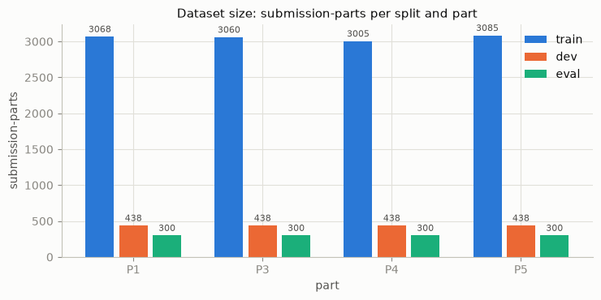
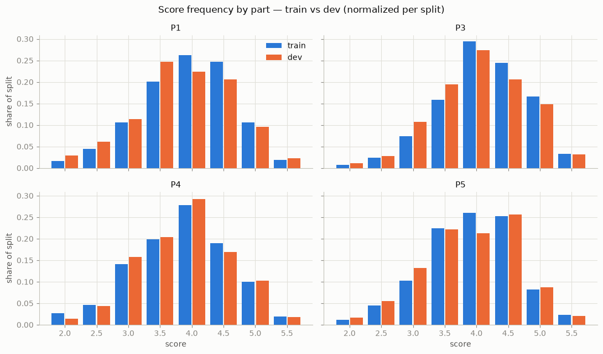
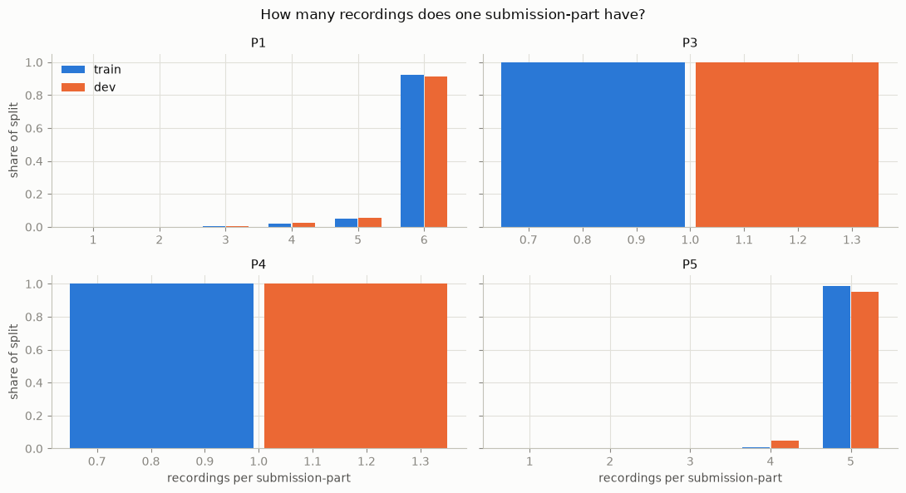
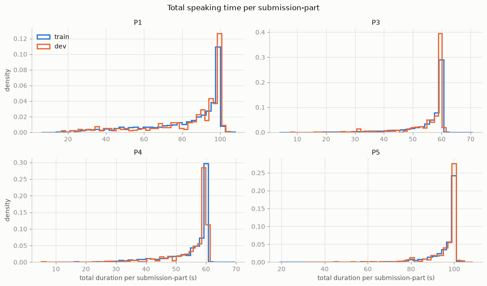
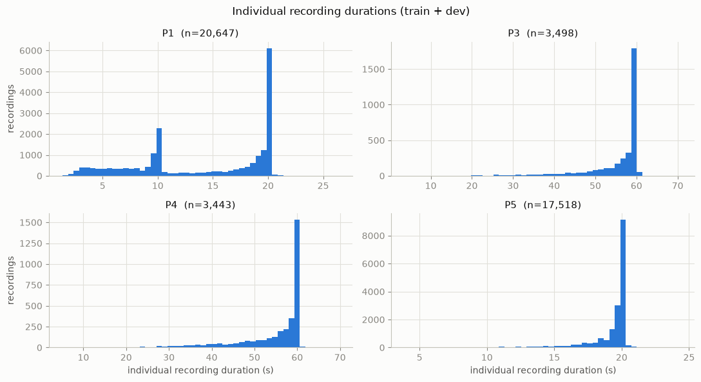
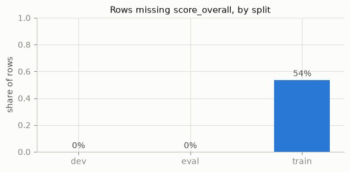
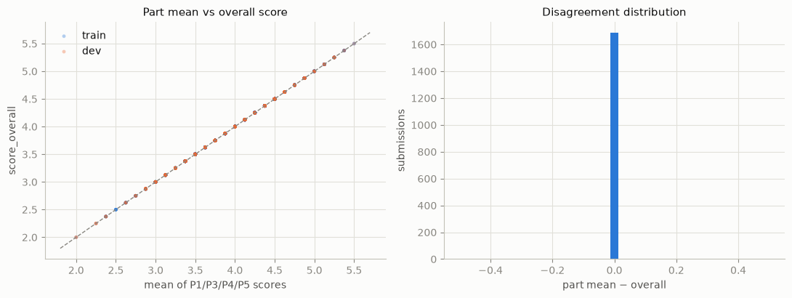
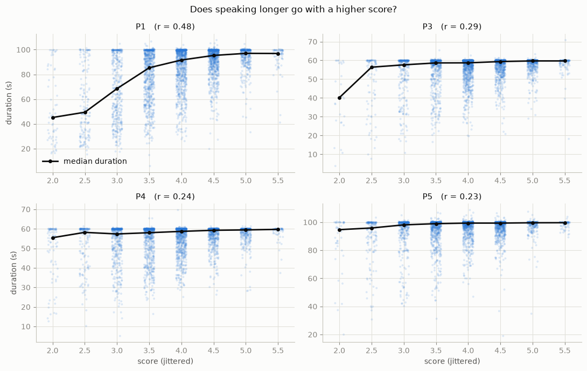
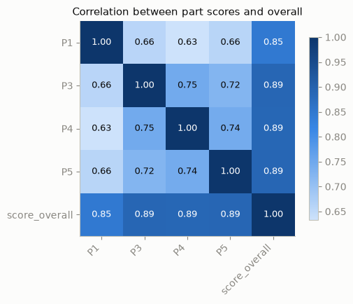

# SpeakTrace — EDA Report

**Source:** [ml/notebooks/01_eda.ipynb](ml/notebooks/01_eda.ipynb) · **Data:** `ml/data/processed/merged.parquet` · **Date:** 2026-08-06

## Dataset at a glance

- **15,170 submission-parts** (rows) covering **45,106 individual recordings** and **~279.4 hours of audio** (train + dev).
- Columns: `submission_id`, `part` (P1 / P3 / P4 / P5), `score` (per-part), `score_overall`, `split`, `audio_files` (list of `.flac` paths).
- Splits: **train 12,218**, **dev 1,752**, **eval 1,200** (eval carries no scores for us).
- Scores range **2.0–5.5 in 0.5 steps**; the median is 4.0 for every split × part.

---

## 1. Dataset size

All splits are balanced across the four parts. Dev has exactly 438 rows per part; train has 3,005–3,085 per part, so **train is roughly 7× dev**. Eval is the smallest split (300 per part).

## 2. Score distribution — train vs dev

| split | part | count | median | mean | std | min | max |
|-------|------|------:|-------:|-----:|----:|----:|----:|
| dev | P1 | 438 | 4.0 | 3.844 | 0.780 | 2.0 | 5.5 |
| dev | P3 | 438 | 4.0 | 4.031 | 0.731 | 2.0 | 5.5 |
| dev | P4 | 438 | 4.0 | 3.863 | 0.727 | 2.0 | 5.5 |
| dev | P5 | 438 | 4.0 | 3.888 | 0.749 | 2.0 | 5.5 |
| train | P1 | 3,068 | 4.0 | 3.953 | 0.726 | 2.0 | 5.5 |
| train | P3 | 3,060 | 4.0 | 4.136 | 0.692 | 2.0 | 5.5 |
| train | P4 | 3,005 | 4.0 | 3.861 | 0.756 | 2.0 | 5.5 |
| train | P5 | 3,085 | 4.0 | 3.939 | 0.706 | 2.0 | 5.5 |

**Found:** after normalizing each split (train is ~7× dev), the orange and blue bars track each other closely in every part — **dev is a faithful miniature of train**, so metrics measured on dev should transfer. Scores concentrate around 3.5–4.5; P3 runs slightly higher on average (mean ≈ 4.1) and the extremes (2.0, 5.5) are rare everywhere.

## 3. Recordings per submission-part

Count of rows by number of recordings (train + dev):

| part | 1 | 2 | 3 | 4 | 5 | 6 |
|------|--:|--:|--:|--:|----:|----:|
| P1 | 1 | 4 | 12 | 74 | 184 | 3,231 |
| P3 | 3,498 | – | – | – | – | – |
| P4 | 3,443 | – | – | – | – | – |
| P5 | 2 | 5 | 13 | 48 | 3,455 | – |

**Found:** **no row has zero or missing audio.** The structure is fixed per part: **P3 and P4 are always a single recording**, **P5 is almost always five clips**, and **P1 is usually six shorter clips** (the interview questions). The rare P1/P5 rows with fewer clips are partially answered attempts. Nothing exceeds six recordings (p99 = 6, no outliers above it).

## 4. Audio duration

Individual recordings (45,106 total, train + dev):

| part | count | mean (s) | std | min | 25% | 50% | 75% | max |
|------|------:|-----:|----:|----:|----:|----:|----:|----:|
| P1 | 20,647 | 14.03 | 5.99 | 1.36 | 9.47 | 16.38 | 19.96 | 26.38 |
| P3 | 3,498 | 55.36 | 7.89 | 3.75 | 54.43 | 59.04 | 59.89 | 70.81 |
| P4 | 3,443 | 54.59 | 8.24 | 5.12 | 52.38 | 58.70 | 59.89 | 69.61 |
| P5 | 17,518 | 19.10 | 2.06 | 3.92 | 19.28 | 19.96 | 19.96 | 24.40 |

Total speaking time per submission-part (mean): P1 ≈ 83 s, P3 ≈ 55 s, P4 ≈ 55 s, P5 ≈ 95 s — consistent between train and dev.

**Found:** total speaking time clusters near a **per-part ceiling** (~100 s for P1/P5, ~60 s for P3/P4) — the tasks fill a fixed time window. The long left tails are candidates for **truncated or abandoned attempts**. Individually, P3/P4 are one continuous ~55 s recording, P1 is up to six clips of varied length (~14 s on average), and P5 is five ~20 s clips.

## 5. Missing coverage

| split | no audio | no part score | no `score_overall` | rows |
|-------|---------:|--------------:|-------------------:|-----:|
| dev | 0 | 0 | 0 | 1,752 |
| eval | 0 | 0 | 0 | 1,200 |
| train | 0 | 0 | **6,559** | 12,218 |

**Found:** audio and per-part scores are complete everywhere. **Only train has gaps: ~54% of its rows lack `score_overall`**, and 5,395 train submissions contributed fewer than four parts (3,991 with just one part, 973 with two, 431 with three). Dev and eval submissions are all complete, so part-level training loses nothing, but overall-score supervision exists for only about half of train.

## 6. Label consistency: is `score_overall` just the mean of the parts?

Across the **1,685 submissions** that have all four part scores plus an overall score:

- exact agreement (mean of parts == overall): **100.0%**
- max |part mean − overall|: **0.000**

**Found:** `score_overall` is **fully derived — it is exactly the mean of the four part scores**, not an independent judgment. A model that predicts the four part scores gets the overall score for free, and the missing `score_overall` values in train can be reconstructed for any submission with all four parts.

## 7. Relationships: duration, recording count, and scores

Pearson correlation with the part score:

| part | duration vs score | recording count vs score |
|------|------------------:|-------------------------:|
| P1 | **0.480** | 0.200 |
| P3 | 0.288 | n/a (always 1) |
| P4 | 0.241 | n/a (always 1) |
| P5 | 0.235 | 0.138 |

Part-score correlation matrix: the parts correlate 0.63–0.75 with each other and **0.85–0.89 with `score_overall`**.

**Found:** speaking longer goes with higher scores most strongly in **P1 (r ≈ 0.48)** — weak speakers give short answers to the open interview questions. In P3–P5 the recording fills a fixed time window, so the duration signal is much weaker (r ≈ 0.24–0.29). The four part scores are strongly correlated and fairly interchangeable as predictors of the overall score.

## 8. Outlier inspection

| type | example | detail |
|------|---------|--------|
| Shortest | `SI141B-01182` (train, P3) | **3.8 s** total, score 2.0 — listened to; likely a failed/near-empty recording |
| Shortest (dev) | `SI114J-00045` (P4) | 5.1 s, score 3.0 |
| Longest | `SI127E-00262` (dev, P5) | 108.7 s, score 4.0 |
| Lowest-scored | e.g. `SI114J-00290` (train, P1) | score 2.0 despite **95.9 s** of speech |
| Highest-scored | e.g. `SI114J-00048` (train, P1) | score 5.5 with only **47.1 s** of speech |

**Found:** very short submission-parts (< 10 s) look like empty or failed recordings and are worth auditing before training. At the same time, score-2.0 responses with 60–99 s of speech and a 5.5 response with only 47 s show that **duration alone cannot separate scores** — content quality dominates.

---

## Key takeaways for modeling

1. **Dev mirrors train** in score distribution, part balance, and durations — dev metrics should transfer.
2. **Predict the four part scores; the overall score is exactly their mean** (100% agreement), so it comes for free and can even be back-filled for train.
3. **~54% of train rows lack `score_overall`** and many train submissions are partial (1–3 parts) — train part-level, not submission-level.
4. **Audio structure is fixed per part** (P1: ≤6 clips, P3/P4: 1 clip, P5: 5 clips) — pipelines can rely on it, but must handle the rare partial P1/P5 rows.
5. **Duration is a weak-to-moderate feature** (useful mostly in P1) and must not be the model's crutch.
6. **Audit the extremes**: sub-10-second submission-parts are probably broken recordings.
